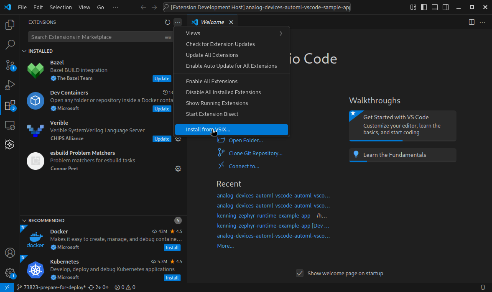
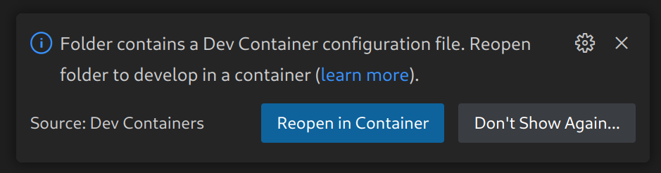
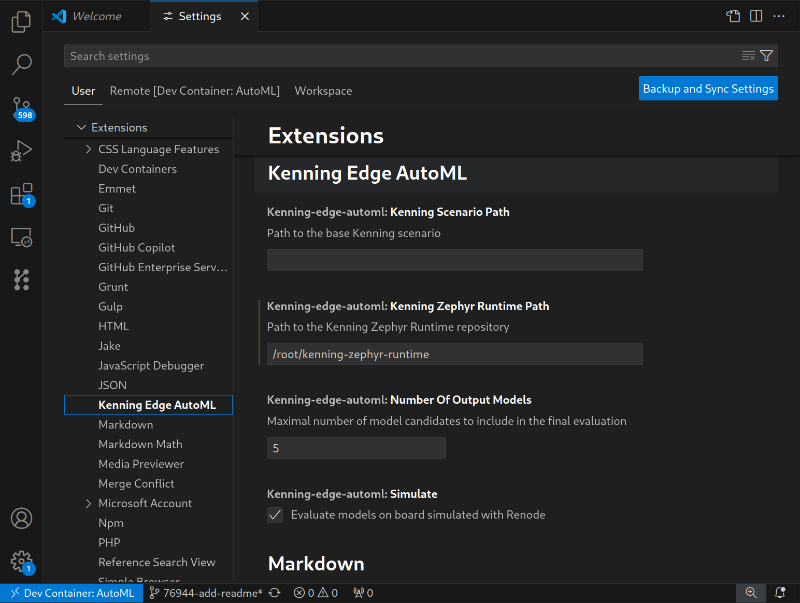
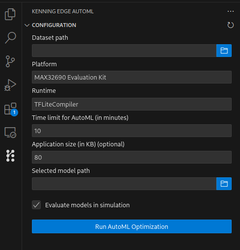
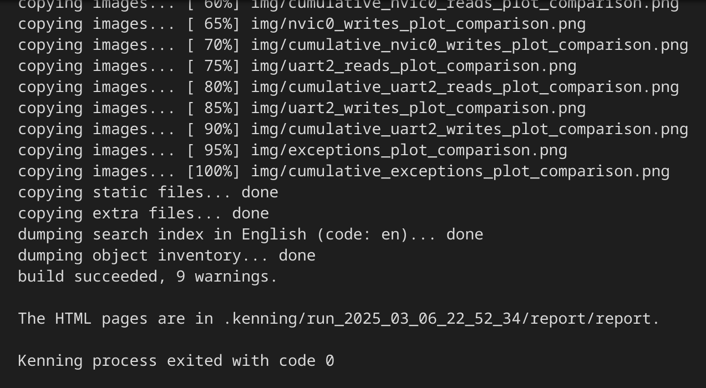
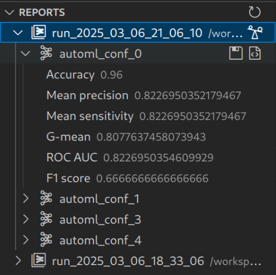
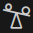
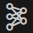
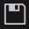
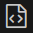

# AutoML plugin for embedded platforms

Copyright (c) 2025 [Analog Devices, Inc.](https://www.analog.com/en/index.html)

Copyright (c) 2025 [Antmicro](https://www.antmicro.com)

VSCode Extension for training, optimizing and deploying tailored models on Edge platforms using AutoML and Neural Architecture Search techniques with the [Kenning ML framework](https://github.com/antmicro/kenning).

## Features

* Loads datasets from files for anomaly detection tasks in CSV format
* Accepts a target platform on which the model will be deployed
* Accepts a target runtime which will be used to evaluate the model
* Accepts application size to make sure the model will fit along with the rest of the application on the target platform
* Automatically trains the models, trying to find the right training parameters and model architecture using AutoML and Neural Architecture Search algorithms
* Optimizes, compiles and deploys models on target hardware
* Evaluates the model, either in simulation or on target hardware
* Provides detailed performance and quality analysis of generated models

## Demo

Video below demonstrates AutoML training, followed by evaluation of generated models on [MAX78002 Evaluation Kit](https://www.analog.com/en/resources/evaluation-hardware-and-software/evaluation-boards-kits/max78002evkit.html) and overview of the generated AutoML summary report.

[](https://github.com/user-attachments/assets/0d98f4b1-b952-4e18-badf-da9b94bf0459)

## Building the plugin

To build a VSIX package containing the plugin, first you need to install `yarn` - follow [Yarn installation](https://classic.yarnpkg.com/lang/en/docs/install) instructions for your system.
Once `yarn` is installed, run the following commands:

```bash
# Allows to use package manages without having to install them
corepack enable
# Install dependencies
yarn install
# Prepare package with plugin
yarn vsix-package
```

The plugin should be available under `automl-embedded-0.0.1.vsix`.
In order to install it, go to Extensions, click `Install from VSIX...` and choose the newly built package.



## Plugin requirements

* Visual Studio Code
* [Kenning](https://github.com/antmicro/kenning) for training, optimizing and deploying models on hardware
* [Kenning Zephyr Runtime](https://github.com/antmicro/kenning-zephyr-runtime) for running created models on Zephyr RTOS on target platform.
  It is needed for model evaluation, either in simulation or on hardware.
* [Yarn](https://classic.yarnpkg.com/en/) for building the plugin
* (optional) [Renode](https://renode.io) for simulating the target platform
* (optional) [Maxim Microcontrollers SDK (MSDK)](https://github.com/analogdevicesinc/msdk) for flashing Analog Devices platforms, such as MAX32690 or MAX78002
* (optional) Prepared [ai8x-training](https://github.com/analogdevicesinc/ai8x-training) and [ai8x-synthesis](https://github.com/analogdevicesinc/ai8x-synthesis) projects to use the MAX78002 CNN accelerator

### Setting up a Development Container

The easiest way to set up the environment for application and AutoML development is to develop inside a container using [Visual Studio Code Dev Containers](https://code.visualstudio.com/docs/devcontainers/containers).

This repository provides two Dev Container definitions: one for general use and one for developing the AutoML VS Code extension.

- The Dev Container for general use is named `AutoML`, and is defined in `.devcontainer/automl/devcontainer.json`.
- The Dev Container for extension development is named `automl-embedded extension development`, and is defined in `.devcontainer/development/devcontainer.json`.

To start the Dev Container, click the `Reopen in Container` button in VS Code when the pop-up appears, or run the `DevContainers: Reopen in Container` command from the Command Palette. You'll then be prompted to select which container you want to open. For general use, select "AutoML".



This will automatically build the image defined by Dockerfile and reopen the working directory inside the container, including all necessary software for the plugin.

#### Installing MSDK

The MSDK is required to perform training on Analog Devices physical boards, such as the MAX32690 EV kit and MAX78002 EV kit, and is not installed in the Dev Container by default. The Dockerfile may be modified by the user to install the MSDK and set the required environment variables. For details, refer to [Docker-based installation](docs/user-guide/installation/docker-install.md). Installation and use are subject to acceptance of Analog Devices license terms.

#### Prepare ai8x repositories

**NOTE:** The steps below are required only for deploying models on MAX78002 using the AI8X runtime running on the CNN accelerator.

In order to generate sources running models on the CNN accelerator for the MAX78002 platform, [ai8x-training](https://github.com/analogdevicesinc/ai8x-training) and [ai8x-synthesis](https://github.com/analogdevicesinc/ai8x-synthesis) repositories with their dependencies (in the `.venv` virtual environments) need to be downloaded.
Moreover, paths to the repositories have to be assigned to the `AI8X_TRAINING_PATH` and `AI8X_SYNTHESIS_PATH` environment variables.
Alternatively, paths to both repositories can be passed in the VSCode plugin settings.

For [ai8x-training](https://github.com/analogdevicesinc/ai8x-training), the repository can be prepared in the following way:

```bash
git clone --recurse-submodules https://github.com/analogdevicesinc/ai8x-training.git
cd ai8x-training
python3 -m venv .venv
source .venv/bin/activate
pip3 install --upgrade pip
pip3 install -r requirements.txt
export AI8X_TRAINING_PATH=$(pwd)
```

Similar steps need to be applied for [ai8x-synthesis](https://github.com/analogdevicesinc/ai8x-synthesis):

```bash
git clone https://github.com/analogdevicesinc/ai8x-synthesis.git
cd ai8x-synthesis
python3 -m venv .venv
source .venv/bin/activate
pip3 install --upgrade pip
pip3 install -r requirements.txt
export AI8X_SYNTHESIS_PATH=$(pwd)
```

## Using the plugin

The plugin is originally meant for Zephyr applications.
The easiest way to integrate generated models is to use Kenning Zephyr Runtime.

### Project and environment preparations

First, clone the repository:

```bash
mkdir workspace && cd workspace
git clone https://github.com/analogdevicesinc/automl-embedded.git
cd automl-embedded
```

Then, open the project in VSCode:

```bash
code .
```

Assuming the Dev Container Extension is installed in VSCode, the previously mentioned popup with the `Reopen in Container` button should appear. Accept and wait for the Dev Container to configure.

Once the Dev Container is ready, install the VSCode Extension in the Dev Container.

After installing the plugin, open a Terminal in VS Code. The terminal uses the Dev Container environment. Run the following commands in the automl-embedded project directory, which is opened by default:

```bash
west init -l .
west update
west zephyr-export
```

It will fetch Zephyr, Kenning Zephyr Runtime and other dependencies for the application.
The fetched Kenning Zephyr Runtime repository will be used by the plugin to build an evaluation app for testing models before deployment on hardware.

### Setting up the plugin

The plugin introduces a few configuration options that can be found in Settings (`File->Preferences->Settings`) under the `Extensions->Kenning Edge AutoML` section:

* **Kenning Zephyr Runtime Path** - has to point to a valid directory with Kenning Zephyr Runtime (e.g. `/workspaces/kenning-zephyr-runtime/`).
* **Number Of Output Models** - maximal number of model candidates to include in the final evaluation
* **Kenning Scenario Path** (optional) - path to a base [Kenning scenario](https://antmicro.github.io/kenning/json-scenarios.html), the default one is defined as `DEFAULT_BASE_SCENARIO` in [AutoML scenario template](src/kenning/autoMLScenarioTemplate.ts).
* **Zephyr SDK Path** (optional) - path to the [Zephyr SDK](https://docs.zephyrproject.org/latest/develop/toolchains/zephyr_sdk.html) directory, can also be passed with the `$ZEPHYR_SDK_PATH` environmental variable.
* **Use CUDA** - indicates whether the GPU will be used to train models.
* **PyRenode Path** (optional) - path to the Renode package or binary, can also be configured with the `PYRENODE_PKG` or `PYRENODE_BIN` environmental variables.
  Check [pyrenode3 project](https://github.com/antmicro/pyrenode3) for available variables and options.
  Renode packages are available at [builds.renode.io](https://builds.renode.io).
* **UART Path** (optional) - path to the board's UART used for communication between Kenning and Kenning Zephyr Runtime (e.g. `/dev/ttyUSB0`). It is recommended to set this field to the corresponding device, as it's used as a fall-back mechanism when automatic detection fails. Ensure that the device has been forwarded to the container (e.g. verify that `ls /dev/` lists your device's name). See [Docker-based installation](docs/user-guide/installation/docker-install.md) for details on using the `runArgs` setting to forward devices to Dev Containers.
* **OpenOCD Path** (optional) - path to the OpenOCD binary from [MaximMicrosSDK](https://github.com/analogdevicesinc/msdk), required for evaluation on Analog Devices hardware, can also be provided via `$PATH`.
* **ai8x-training** (optional) - location of the [ai8x-training](https://github.com/analogdevicesinc/ai8x-training) repository, required for the `ai8x` runtime on the MAX78002 board.
* **ai8x-synthesis** (optional) - location of the [ai8x-synthesis](https://github.com/analogdevicesinc/ai8x-synthesis) repository, required for the `ai8x` runtime on the MAX78002 board.



### Running AutoML tasks

Running an AutoML flow can be summarized in a few simple steps:

* Click on the AutoML icon (K in the leftmost sidebar)

  

* Choose the AutoML task configuration:
  * In `Dataset path`, set path or link to a dataset - e.g. `https://dl.antmicro.com/kenning/datasets/anomaly_detection/cats_nano.csv`
  * Select `Platform` from the dropdown list - e.g. `MAX32690 Evaluation Kit`
  * Select `Runtime` from the dropdown list - e.g. `TFLite`
  * In `Time limit`, set a time limit for the AutoML part of the run (in minutes)
  * Define `Application size` - e.g. 80 KB
  * Choose `Evaluate models in simulation` to run evaluation on the board simulated with Renode, instead of the real one
  * (Optional) In `Selected model path` set target path where the selected model should be saved (e.g. `/workspaces/model.tflite` in Dev Container environment)

* To run AutoML, click `Run AutoML Optimization`
* A successful execution finishes with `Kenning process exited with code 0`

  

Once the AutoML process finishes successfully, a new report should appear in `REPORTS`:



The view with reports follows the structure:

*  `run_` represents a single AutoML session
  * The scale button  opens a summary report for a given run
  * Under the `run_` entry, the  `automl_conf_` entities represent individual models
    * The floppy disk button  saves the model in the path specified in `Selected model path` or asks to provide a new one, if the input field is empty
    * The file button  opens configuration for a given model
    * Each model contains a summary of its metrics calculated on a training set

## Running the generated models

A sample application that runs the models generated by the AutoML plugin can be found in the [kenning-zephyr-runtime-example-app repository](https://github.com/antmicro/kenning-zephyr-runtime-example-app) repository.

Refer to the application's repository for build and usage instructions.

## Adjusting AutoML scenarios

To provide a custom scenario with an altered configuration, the plugin provides the **Kenning Scenario Path** setting.
It accept JSON or YAML files with a Kenning scenario describing the AutoML flow.

Examples of AutoML scenarios:

* [AutoML flow for the MAX32690 Evaluation Kit for anomaly detection (VAE model)](https://github.com/antmicro/kenning/blob/main/scripts/configs/automl-scenario.yml)
* [AutoML flow for the MAX78002 Evaluation Kit for anomaly detection/classification (CNN model)](https://github.com/antmicro/kenning/blob/main/scripts/configs/automl-cnn-scenario.yml)

For more details on creating Kenning scenarios and investigating available classes, follow:

* [Anomaly detection model training and deployment on the MAX32690 Evaluation Kit](https://antmicro.github.io/kenning/gallery/anomaly-detection-on-mcu.html)
* [Generating anomaly detection models for the MAX32690 Evaluation Kit with AutoML](https://antmicro.github.io/kenning/gallery/anomaly-detection-automl.html)
* [Defining optimization pipelines in Kenning](https://antmicro.github.io/kenning/json-scenarios.html)

## Preparing the dataset for the plugin

The expected columns and structure of the CSV file passed as anomaly detection dataset can be found in [Kenning documentation on deploying anomaly detection models](https://antmicro.github.io/kenning/gallery/anomaly-detection-on-mcu.html#specification-of-the-kenning-datasets-anomaly-detection-dataset-module).
To add support for different datasets, follow [Kenning block development guidelines](https://antmicro.github.io/kenning/kenning-development.html) and [Dataset API](https://antmicro.github.io/kenning/kenning-api.html#dataset-api).

## Defining models and search space for AutoML flows

AutoML model definitions used by this plugin are:

* [PyTorchAnomalyDetectionVAE](https://github.com/antmicro/kenning/blob/main/kenning/modelwrappers/anomaly_detection/vae.py) - used for TensorFlow Lite and microTVM runtimes
* [Ai8xAnomalyDetectionCNN](https://github.com/antmicro/kenning/blob/main/kenning/modelwrappers/anomaly_detection/ai8x_cnn.py) - used for convolutional neural networks that can be deployed on MAX78002's CNN Accelerator

To create custom models that can be configured and modified by the AutoML flow, follow the [Adjusting ModelWrapper for AutoML flow](https://antmicro.github.io/kenning/kenning-development.html#adjusting-modelwrapper-for-automl-flow) chapter in [Kenning documentation](https://antmicro.github.io/kenning/index.html).
