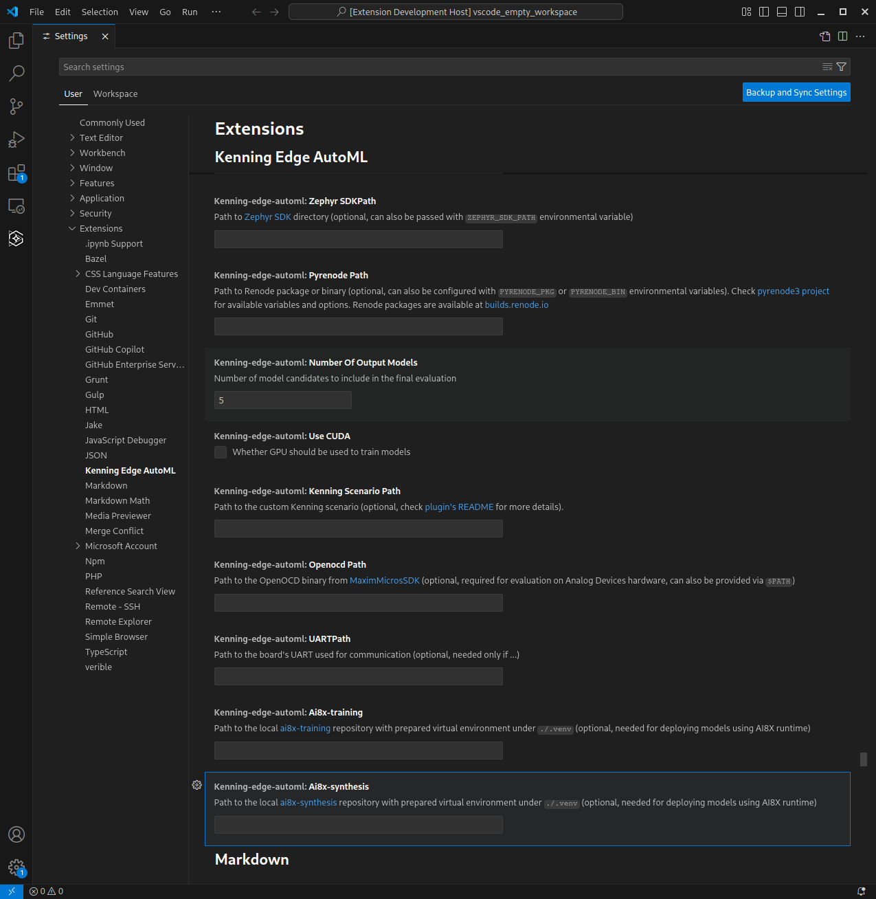
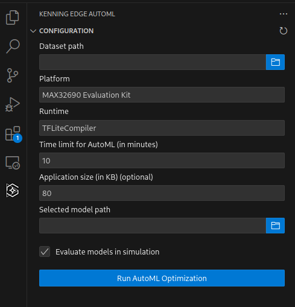

# AutoML plugin for embedded platforms

Copyright (c) 2025 [Analog Devices, Inc.](https://www.analog.com/en/index.html)

Copyright (c) 2025 [Antmicro](https://www.antmicro.com)

VSCode Extension for training, optimizing and deploying tailored models on Edge platforms using AutoML and Neural Architecture Search techniques with the [Kenning ML framework](https://github.com/antmicro/kenning).

## Features

* Loads datasets from files for anomaly detection tasks in CSV format
* Accepts a target platform on which the model will be deployed
* Accepts application size to make sure the model will fit along with the rest of the application on the target platform
* Automatically trains the models, trying to find the right training parameters and model architecture using AutoML and Neural Architecture Search algorithms
* Optimizes, compiles and deploys models on target hardware
* Evaluates the model, either in simulation or on target hardware
* Provides detailed performance and quality analysis of generated models

## Building the plugin

To build a VSIX package containing the plugin, first you need to install `yarn` - follow [Yarn installation](https://classic.yarnpkg.com/lang/en/docs/install/#debian-stable) instructions for your system.
Once `yarn` is installed, run the following commands:

```bash
# Install dependencies
yarn install
# Prepare package with plugin
yarn vsix-package
```

The plugin should be available under `edge-automl-extension-0.0.1.vsix`.
In order to install it, go to Extensions, click `Install from VSIX...` and choose the newly built package.


## Plugin requirements

* Visual Studio Code
* [Kenning](https://github.com/antmicro/kenning) for training, optimizing and deploying models on hardware
* [Kenning Zephyr Runtime](https://github.com/antmicro/kenning-zephyr-runtime) for running created models on Zephyr RTOS on target platform.
  It is needed for model evaluation, either in simulation or on hardware.
* [Yarn](https://classic.yarnpkg.com/en/) for building the plugin
* (optional) [Renode](https://renode.io) for simulating the target platform
* (optional) [Maxim Microcontrollers SDK (MSDK)](https://github.com/analogdevicesinc/msdk) for flashing Analog Devices platforms, such as MAX32690 or MAX78002

### Setting up a Development Container

The easiest way to set up the environment for application and AutoML development is to develop inside a container using [Visual Studio Code Dev Containers](https://code.visualstudio.com/docs/devcontainers/containers).

Sample Docker image definition can be found in [Example project using Kenning Zephyr Runtime](https://github.com/antmicro/kenning-zephyr-runtime-example-app), under [environments/Dockerfile](https://github.com/antmicro/kenning-zephyr-runtime-example-app/blob/main/environments/Dockerfile).

The Dev Container definition can be found in [.devcontainer/automl/devcontainer.json](https://github.com/antmicro/kenning-zephyr-runtime-example-app/blob/main/.devcontainer/automl/devcontainer.json) (VSCode Dev Container configuration).

To start the Dev Container, click the `Reopen in Container` button from the pop-up or run the `DevContainers: Reopen in Container` action.


This will automatically build the image defined by Dockerfile and reopen the working directory inside the container, including all necessary software for the plugin.

### Setting up a local environment

For local development, the following tools are needed:

* [Kenning Zephyr Runtime dependencies](https://github.com/antmicro/kenning-zephyr-runtime/) - follow instructions in the README ([Building the project](https://github.com/antmicro/kenning-zephyr-runtime/?tab=readme-ov-file#building-the-project)) to install all dependencies.
* [Kenning](https://github.com/antmicro/kenning) - the minimal Kenning setup needed for the plugin can be installed using e.g. `pipx`:
  ```bash
  pipx install --force "kenning[tvm,torch,anomaly_detection,auto_pytorch,tensorflow,tflite,reports,renode,uart] @ git+https://github.com/antmicro/kenning.git"
  ```
  Another way is to set up a virtual environment with Kenning and Kenning Zephyr Runtime that will be accessible to VSCode.
* [Renode](https://renode.readthedocs.io/en/latest/introduction/installing.html) - follow instructions.
  Later, configure one of the listed environment variables in [pyrenode3 tool](https://github.com/antmicro/pyrenode3) to point to Renode installation path (build directory, package or Renode binary).

**NOTE:** Kenning supports Python 3.10 or 3.11.
In case of different Python versions available in the system, use e.g. [pyenv](https://github.com/pyenv/pyenv) to create an environment with Python 3.11.

## Using the plugin - example Zephyr project

The plugin is originally meant for Zephyr applications.
The easiest way to integrate generated models is to use Kenning Zephyr Runtime.

A sample application working with this plugin can be found in the [kenning-zephyr-runtime-example-app repository](https://github.com/antmicro/kenning-zephyr-runtime-example-app).

### Project and environment preparations

First, clone the repository:

```bash
mkdir workspace && cd workspace
git clone https://github.com/antmicro/kenning-zephyr-runtime-example-app.git
cd kenning-zephyr-runtime-example-app/
```

Then, open the project in VSCode:

```
code .
```

Assuming the Dev Container Extension is installed in VSCode, the previously mentioned popup with the `Reopen in Container` button should appear. Accept and wait for the Dev Container to configure.

Once the Dev Container is ready, install the VSCode Extension in the Dev Container.

After plugin installation, open Terminal in VSCode (it will use the environment from the Dev Container) and run the following commands in the root project directory:

```
west init -l app
west update
west zephyr-export
```

It will fetch Zephyr, Kenning Zephyr Runtime and other dependencies for the application.
The fetched Kenning Zephyr Runtime repository will be used by the plugin to build an evaluation app for testing models before deployment on hardware.

### Setting up the plugin

The plugin introduces a few configuration options that can be found in Settings (`File->Preferences->Settings`) under the `Extensions->Kenning Edge AutoML` section:
* **Kenning Zephyr Runtime Path** - has to point to a valid directory with Kenning Zephyr Runtime (e.g. `/workspaces/kenning-zephyr-runtime-example-app/kenning-zephyr-runtime/` assuming `kenning-zephyr-runtime-example-app` is opened as a working directory in a Dev Container)
* **Number Of Output Models** - maximal number of model candidates to include in the final evaluation
* **Simulate** - indicates whether to evaluate the model on a real board or one simulated with Renode
* **Kenning Scenario Path** (optional) - path to a base [Kenning scenario](https://antmicro.github.io/kenning/json-scenarios.html), the default one is defined as `DEFAULT_BASE_SCENARIO` in [AutoML scenario template](src/kenning/autoMLScenarioTemplate.ts).



### Running AutoML tasks

Running an AutoML flow can be summarized in a few simple steps:

* Click on the AutoML icon (K in the leftmost sidebar)

  
* Choose the AutoML task configuration:
  * In `Dataset path`, set path or link to a dataset - e.g. `https://dl.antmicro.com/kenning/datasets/anomaly_detection/cats_nano.csv`
  * Select `Platform` from the dropdown list - e.g. `MAX32690 Evaluation Kit`
  * In `Time limit`, set a time limit for the AutoML part of the run (in minutes)
  * Define `Application size` - e.g. 80 KB
  * (Optional) In `Selected model path` set target path where the selected model should be saved (e.g. `/workspaces/kenning-zephyr-runtime-example-app/model.tflite` in Dev Container environment)

* To run AutoML, click `Run AutoML Optimization`
* A successful execution finishes with `Kenning process exited with code 0`
  

Once the AutoML process finishes successfully, a new report should appear in `REPORTS`:


The view with reports follows the structure:
*  `run_` represents a single AutoML session
  * The scale button  opens a summary report for a given run
  * Under the `run_` entry, the  `automl_conf_` entities represent individual models
    * The floppy disk button  saves the model in the path specified in `Selected model path` or asks to provide a new one, if the input field is empty
    * The file button  opens configuration for a given model
    * Each model contains a summary of its metrics calculated on a training set

### Building the application with selected model

Once the preferred model is picked, it can be used in the final application.
With Kenning Zephyr Runtime, the path to the model can be provided using the `-DCONFIG_KENNING_MODEL_PATH` parameter when running `west build`, e.g.:

```bash
west build \
  -p always \
  -b max32690evkit/max32690/m4 app -- \
  -DEXTRA_CONF_FILE="tflite.conf" \
  -DCONFIG_KENNING_MODEL_PATH=\"/workspaces/kenning-zephyr-runtime-example-app/model.tflite\"
```

Where `/workspaces/kenning-zephyr-runtime-example-app/model.tflite` is a path to the model selected in the AutoML plugin.

In the example project used here, in [.vscode/tasks.json](.vscode/tasks.json) there are the following tasks:

* `Build Zephyr app` - builds the application implemented in the project with the selected model,
* `Simulate app in Renode` - simulates the built application.

To flash the actual board, follow the flashing instructions for the specific board.
